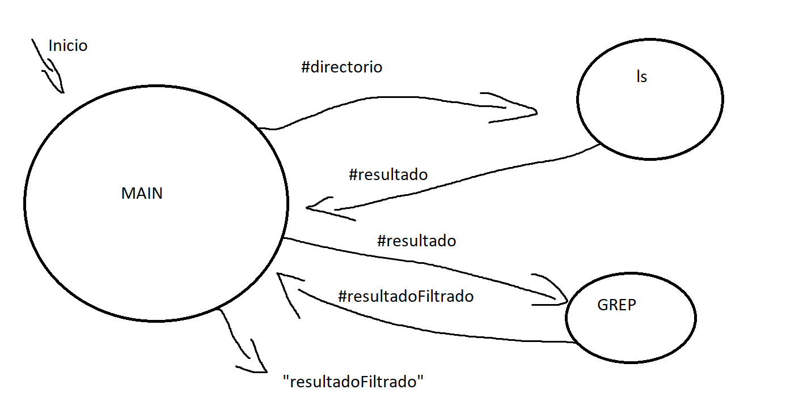
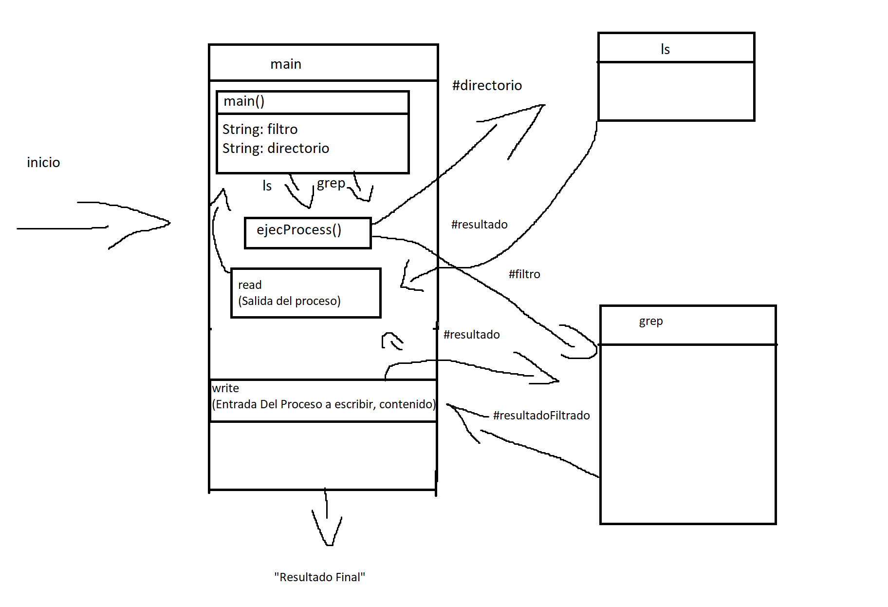

# LS a GREP Documentacion

## Funcionamiento

### Esquema1



Para el esquema 1 estan los procesos esenciales:

- Iniciamos en el MAIN
- Mandamos un directorio a ls
- Ls devuelve los documentos en ese directorio
- MAIN envia ese resultado a GREP mas el filtro
- Grep regresa el resultado filtrado
- MAIN pinta el resultado filtrado

### Esquema2



Aqui tengo mas especificamente que hace cada proceso

> Como ls y grep no los puedo manipular estan vacios por dentro

El funcionamiento es el mismo, solo que tenemos las funciones de main que interactuan con los procesos

- MAIN contiene filtro y directorio
- MAIN manda a `ejecProcess()` el comando que ejecuta, en este caso ls
- A su vez se envia el directorio
- `read()` lee la salida de ls
- MAIN envia `ejecProcess()` con grep y el filtro
- Main le manda a `write()` que escriba en grep la salida de ls
- `read()` lee la salida de grep, el contenido filtrado
- Por ultimo pinta el Resultado final

### Usarlo

Finalmente para usarlo hay que ir a MAIN y modificar lo siguiente

`public static final String COMANDO_A_USAR = "ls";`
`public static final String FILTRO = "host*";`
`public static final String DIRECTORIO = "//etc";`

- Pones el comando que quieres usar, en este caso usamos el comando ls para enviarlo a grep
- Pones que va a filtrar
- Pones un directorio, en este ejemplo ls necesita el directorio donde va a ejecutarse

---

## Anotaciones

***Esta parte de codigo esta repetida cambiando la salida de donde obtiene la informacion la salidaGrep > salidaComando***

No se me ocurrio una forma de sacarlo a una funcion porque siempre tiene que seguir los pasos de, comprobar si la salida tiene un parametro extra, si lo tiene creamos un error, lo printamos y terminamos el programa.

```java
if (salidaEnviado.length != 1) {

    String[] datos = {MSG_ERROR, salidaGrep[SALIDA_NORMAL], salidaGrep[SALIDA_FALLIDA]};
    System.out.println(crearSalida(datos));

    System.exit(SALIDA_SYSTEM);
}
```

***Para diferenciar si tiene que escribir o no, en ejecComando envio un null de segundo parametro, me parece que deberia haber otra forma de hacerlo pero no la se***

```java
private static String[] ejecCommand(String[] comando, String[] writeInProcess){
        
        final String ERROR_VALUE = "Error al ejecutar el comando";
        
        try {
            Process process = Runtime.getRuntime().exec(comando);
            String output;
            String errOutput;

            if (writeInProcess != null) write(process.getOutputStream(), writeInProcess);

            errOutput = read(process.getErrorStream());
            output = read(process.getInputStream());

            int exitVal = process.waitFor();
            if (exitVal == 0) {

                return new String[] {output};

            } else {

                return new String[] {output, errOutput};
            }

        } catch (IOException | InterruptedException e) {

            return new String[]{ERROR_VALUE, e.toString()};

        }
    }
```
